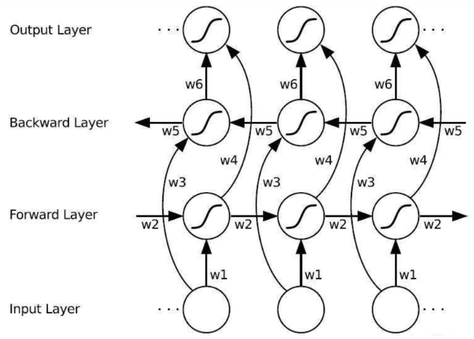

# BiLSTM模型实现英文新闻标题分类任务

# 摘要

本次实验实现了一个基于BiLSTM模型的文本分类任务。本次实验自认为有三个亮点，第一个是手动实现了LSTM，第三个是本次实验数据处理过程非常精细，第二个是模型准确率较高，最后在测试集上准确率达到了75%。

# 实验引言

本次实验的目的是利用nlp的常见算法完成一个文本分类任务，因为文本分类是最为基本的nlp任务。

文本分类通常分为统计机器学习和深度学习两类方法。本次实验采用了深度方法，构建了BiLSTM模型实现了文本分类。**BiLSTM**在transformer出现之前基本是应用最广的nlp模型，虽然目前的nlp研究已经全面拥抱transformer，我认为还是有必要对于BiLSTM的细节进行学习和深究，本次也采用了手动方式实现了LSTM层。这一部分将在**第三章**呈现

文本分类的另一个重点是**数据处理**，因为数据集的格式通常不能直接用来实验，而且数据集中也存在着许多的噪声，需要进行数据清洗和过滤，以更加适配我们所要实现的任务。本次实验中也精细地进行了数据处理。这一部分将在**第四章**重点呈现

# 实验方法

本次实验使用手动实现的BiLSTM模型来实现英文新闻标题的文本分类任务。

本次使用的数据集为：Kaggle数据集平台上的Topic Labeled News Dataset数据。这一数据集的content是一个大约10-20个word的news标题。这一数据集的类别分为八类：{'TECHNOLOGY', 'HEALTH', 'WORLD', 'SPORTS', 'NATION', 'BUSINESS', 'SCIENCE', 'ENTERTAINMENT'}

数据的字段举例如下，下面的这一条数据是一个topic为SCIENCE的news title：


本次的算法为BiLSTM模型

LSTM模型的一个cell展示如下：


具体的计算过程我使用latex编辑为：


多个这样的cell拼接可以构成深度网络。

在每一层内，横向来看，在连接中加入了peephole连接，使得上一步的输出ct也进入下一步中。

LSTM在深度上的实现方法是将上一层的输出y作为下一层对应cell的输入x。


Bi-LSTM 神经网络结构模型分为 2 个独立的LSTM，输入序列分别以正序和逆序输入至 2 个LSTM 神经网络进行特征提取。Bi-LSTM 中的 2 个 LSTM 神经网络参数是相互独立的，它们只共享 word-embedding词向量列表。在t时刻，两条LSTM链路同时的结果加起来作为输出。




# 实验内容

实验分为数据加载，词向量化，模型搭建，模型训练和推理这些步骤。

实验分为数据加载，词向量化，模型搭建，模型训练和推理。

首先展示，实验到最后形成的文件夹如下：


## 数据加载和词向量化

数据从kaggle网站下载出来之后是一个csv文件labelled_newscracher_dataset.csv，数据的字段如上面的第三章所示。

首先需要读入数据和划分训练测试集。数据使用pandas进行读入，然后 按照70：15：15的比例来划分训练集、验证集、测试集。并转存为csv文件。 

接下来需要进行数据清洗，需要进行去除特殊字符、标点符号、开头单词大小写、缩写问题等等。

使用下面的lambda表达式来进行数据清洗：

```
sentences = sentences.apply(lambda x: clean_special_chars(x, punct, punct_mapping, contraction_mapping))

def clean_special_chars(text, punct, mapping, contraction_mapping):
    for p in contraction_mapping:
        text = text.replace(p, contraction_mapping[p])
    for p in mapping:
        text = text.replace(p, mapping[p])
    for p in punct:
        text = text.replace(p, f' {p} ')
    specials = {'\u200b': ' ', '…': ' ... ', '\ufeff': '', 'करना': '',
                'है': ''}  # Other special characters that I have to deal with in last
    for s in specials:
        text = text.replace(s, specials[s])
    return text
```

特殊字符的mapping:

```
punct = "/-'?!.,#$%\'()*+-/:;<=>@[\\]^_`{|}~" + '""“”’' + '∞θ÷α•à−β∅³π‘₹´°£€\×™√²—–&'
punct_mapping = {"‘": "'", "₹": "e", "´": "'", "°": "", "€": "e", "™": "tm", "√": " sqrt ", "×": "x", "²": "2",
                     "—": "-", "–": "-", "’": "'", "_": "-", "`": "'", '“': '"', '”': '"', '“': '"', "£": "e",
                     '∞': 'infinity', 'θ': 'theta', '÷': '/', 'α': 'alpha', '•': '.', 'à': 'a', '−': '-', 'β': 'beta',
                     '∅': '', '³': '3', 'π': 'pi', }
```

缩写的mapping

```
contraction_mapping = {"here's": "here is", "it's": "it is", "ain't": "is not", "aren't": "are not",
                               "can't": "cannot", "'cause": "because", "could've": "could have",
                               "couldn't": "could not",
                               "didn't": "did not", "doesn't": "does not", "don't": "do not", "hadn't": "had not",
                               "hasn't": "has not", "haven't": "have not", "he'd": "he would", "he'll": "he will",
                               "he's": "he is", "how'd": "how did", "how'd'y": "how do you", "how'll": "how will",
                               "how's": "how is", "I'd": "I would", "I'd've": "I would have", "I'll": "I will",
                               "I'll've": "I will have", "I'm": "I am", "I've": "I have", "i'd": "i would",
                               "i'd've": "i would have", "i'll": "i will", "i'll've": "i will have", "i'm": "i am",
                               "i've": "i have", "isn't": "is not", "it'd": "it would", "it'd've": "it would have",
                               "it'll": "it will", "it'll've": "it will have", "it's": "it is", "let's": "let us",
                               "ma'am": "madam", "mayn't": "may not", "might've": "might have", "mightn't": "might not",
                               "mightn't've": "might not have", "must've": "must have", "mustn't": "must not",
                               "mustn't've": "must not have", "needn't": "need not", "needn't've": "need not have",
                               "o'clock": "of the clock", "oughtn't": "ought not", "oughtn't've": "ought not have",
                               "shan't": "shall not", "sha'n't": "shall not", "shan't've": "shall not have",
                               "she'd": "she would", "she'd've": "she would have", "she'll": "she will",
                               "she'll've": "she will have", "she's": "she is", "should've": "should have",
                               "shouldn't": "should not", "shouldn't've": "should not have", "so've": "so have",
                               "so's": "so as", "this's": "this is", "that'd": "that would",
                               "that'd've": "that would have",
                               "that's": "that is", "there'd": "there would", "there'd've": "there would have",
                               "there's": "there is", "here's": "here is", "they'd": "they would",
                               "they'd've": "they would have", "they'll": "they will", "they'll've": "they will have",
                               "they're": "they are", "they've": "they have", "to've": "to have", "wasn't": "was not",
                               "we'd": "we would", "we'd've": "we would have", "we'll": "we will",
                               "we'll've": "we will have", "we're": "we are", "we've": "we have", "weren't": "were not",
                               "what'll": "what will", "what'll've": "what will have", "what're": "what are",
                               "what's": "what is", "what've": "what have", "when's": "when is", "when've": "when have",
                               "where'd": "where did", "where's": "where is", "where've": "where have",
                               "who'll": "who will", "who'll've": "who will have", "who's": "who is",
                               "who've": "who have",
                               "why's": "why is", "why've": "why have", "will've": "will have", "won't": "will not",
                               "won't've": "will not have", "would've": "would have", "wouldn't": "would not",
                               "wouldn't've": "would not have", "y'all": "you all", "y'all'd": "you all would",
                               "y'all'd've": "you all would have", "y'all're": "you all are",
                               "y'all've": "you all have",
                               "you'd": "you would", "you'd've": "you would have", "you'll": "you will",
                               "you'll've": "you will have", "you're": "you are", "you've": "you have"}
```

多次使用text = text.replace(p, mapping[p])来进行数据的清洗

词向量采用了GLOVE预训练的词向量。GLOVE是一个预训练的词向量二维矩阵，表示token与embedding之间的映射关系。

借助GLOVE,构建vocab字典和自定义的embedding。其中，vocab字典是文本单词到id的映射，{word: id}。embedding 是id到embedding的映射,{id: embedding}，其中embedding是一个一维列表，本次实验采用了300维度的词向量，所以embedding是一个len为300的列表。

## 数据集构建

构建数据集并统计特征如下：


数据集构建后，输出的数据格式为(([多个文本内单词id], , seq_len)，类别id)。一个batch的数据如下


## 模型构建

虽然图示中显示lstm精巧的单独的cell组合而成，但是实际上可以通过一个二维的矩阵表示所有的输入门、输出门、遗忘门。从而实现并行的计算。如下构建了一层LSTM

```
class LSTM(nn.Module):
    def __init__(self, input_size, hidden_size, output_size):
        super(LSTM, self).__init__()
        self.hidden_size = hidden_size

        # 定义遗忘门可训练参数
        # 权重（下同）
        self.W_f = nn.Parameter(torch.randn(input_size, hidden_size))
        self.U_f = nn.Parameter(torch.randn(hidden_size, hidden_size))
        # 偏置（下同）
        self.b_f = nn.Parameter(torch.randn(hidden_size))

        # 定义输入门Sigmoid层可训练参数
        self.W_i = nn.Parameter(torch.randn(input_size, hidden_size))
        self.U_i = nn.Parameter(torch.randn(hidden_size, hidden_size))
        self.b_i = nn.Parameter(torch.randn(hidden_size))

        # 定义输入门tanh层可训练参数
        self.W_c = nn.Parameter(torch.randn(input_size, hidden_size))
        self.U_c = nn.Parameter(torch.randn(hidden_size, hidden_size))
        self.b_c = nn.Parameter(torch.randn(hidden_size))

        # 定义输出门可训练参数
        self.W_o = nn.Parameter(torch.randn(input_size, hidden_size))
        self.U_o = nn.Parameter(torch.randn(hidden_size, hidden_size))
        self.b_o = nn.Parameter(torch.randn(hidden_size))

        # 定义h2o可训练参数
        self.W_h = nn.Parameter(torch.randn(hidden_size, output_size))
        self.b_h = nn.Parameter(torch.randn(output_size))

        # 定义softmax层
        self.softmax = nn.LogSoftmax(dim=1)

    def forward(self, input, hidden_state, cell_state):
        # 遗忘门
        f_gate = torch.sigmoid(torch.mm(input, self.W_f) + torch.mm(hidden_state, self.U_f) + self.b_f)

        # 输入门sigmoid层
        i_gate = torch.sigmoid(torch.mm(input, self.W_i) + torch.mm(hidden_state, self.U_i) + self.b_i)

        # 输入门tanh层
        c_tilde = torch.tanh(torch.mm(input, self.W_c) + torch.mm(hidden_state, self.U_c) + self.b_c)

        # 输出门
        o_gate = torch.sigmoid(torch.mm(input, self.W_o) + torch.mm(hidden_state, self.U_o) + self.b_o)

        # 得出新细胞状态
        cell_state = f_gate * cell_state + i_gate * c_tilde

        # 得出新隐藏层状态
        hidden_state = o_gate * torch.tanh(cell_state)

        # 得出output
        output = torch.mm(hidden_state, self.W_h) + self.b_h
        output = self.softmax(output)
        return output, hidden_state, cell_state

    # 初始化隐藏状态
    def initHidde(self):
        hidden_state = torch.zeros(1, self.hidden_size)
        cell_state = torch.zeros(1, self.hidden_size)
        return hidden_state, cell_state
```

接下来构建BiLSTM，分为embedding层，LSTM部分和线性输出层。

```
class BiLSTM_model(nn.Module):
    def __init__(self, vocab_size, ntoken, d_emb=300, d_hid=128, nlayers=2, dropout=0.1, num_classes = 8, embedding_weight=None):
        super(BiLSTM_model, self).__init__()
        # 将"预训练的词向量"整理成 token->embedding 的二维映射矩阵 emdedding_weight 的形式，初始化 _weight
        # 当 emdedding_weight == None 时，表示随机初始化
        self.embed = nn.Embedding(num_embeddings=vocab_size, embedding_dim=d_emb, _weight=embedding_weight)
        # self.embedding = nn.Embedding(config.n_vocab, config.embed, padding_idx=config.n_vocab - 1)
        self.lstm = LSTM(input_size=d_emb, hidden_size=d_hid, num_layers=nlayers, bidirectional=True, batch_first=True)
        #-----------------------------------------------------begin-----------------------------------------------------#
        # bilstm 隐藏层数据的处理和选择方法
        self.dropout = nn.Dropout(dropout)  # 可选
        # self.classifier = nn.Linear(ntoken * d_hid * 2, num_classes)
        self.classifier = nn.Linear(d_hid * 2, num_classes)
        # 请自行设计分类器
        #------------------------------------------------------end------------------------------------------------------#

    def forward(self, x):
        x = self.embed(x)
        x = self.lstm(x)[0]
        #-----------------------------------------------------begin-----------------------------------------------------#
        # 对 bilstm 的隐藏层输出进行处理和选择，并完成分类
        x = self.dropout(x)
        # x = x.reshape(-1, 50 * 80 * 2)# ntoken*nhid*2 (2 means bidirectional)
        x = self.classifier(x[:, -1, :])
        #------------------------------------------------------end------------------------------------------------------#
        return x
```

通过引用上面构建的LSTM类来构建LSTM层。然后使用了预置的embedding层，最后通过nn.Linear(d_hid * 2, num_classes)来输出结果。

## 模型pipeline

最终在train.py文件中，构建了整体的训练和推理框架。导入dataset，构建dataloader，模型实例化，设置优化器，设置损失函数，循环train的过程中进行valid，最后test进行推理。

```
if __name__ == '__main__':
    data_path = ''
    embed_path = 'glove.6B.300d.npz'
    config = Config(data_path, embed_path)

    tqdm.pandas()
    UNK, PAD = '<UNK>', '<PAD>'
    MAX_VOCAB_SIZE = 7000

    vocab, train_data, dev_data, test_data = build_dataset(config)

    data_loader_train = build_iterator(train_data, config)
    data_loader_valid = build_iterator(dev_data, config)
    data_loader_test = build_iterator(test_data, config)

    model = BiLSTM_model(vocab_size=MAX_VOCAB_SIZE+2, ntoken=config.max_token_per_sent, d_emb=config.embed,
                              embedding_weight=config.embedding_pretrained).to(config.device)

    # 设置损失函数
    loss_function = nn.CrossEntropyLoss()
    # 设置优化器
    optimizer = torch.optim.Adam(model.parameters(), lr=config.learning_rate, weight_decay=config.weight_decay)

    # 进行训练
    train(num_epochs = config.num_epochs, output_folder = config.save_path,
          device = config.device, batch_size = config.batch_size)

    inverse_vocab = dict([val, key] for key, val in vocab.items())

    # 对测试集进行预测
    predict(config.device, inverse_vocab)
```

## 模型参数

模型的配置参数如下，另外损失函数为CrossEntropy，优化器为Adam：


#  结果

BiLSTM模型训练过程通过tqdm呈现为：


模型训练过程通过matplotlib作图，BiLSTM模型训练过程中的测试集准确率变化和loss变化：


# 结论

本次实验成功地实现了BiLSTM在新闻标题主题分类上的任务。测试集上的准确率达到了75%。实验比较成功。训练的epoch设置为10，在更多的epoch中发现模型的Loss依然下降而测试集准确率出现震荡，说明继续训练将会加重过拟合程度。所以设置epoch为10更合适。

本次实验中我更系统地学习了数据清洗的几种方法。在文本数据中，需要注意特殊字符、大小写、缩写等等问题，这些问题的处理将会极大地提升预训练词向量的覆盖率。

本次实验中我手动实现了BiLSTM模型，从而对于LSTM的原理更加深入地了解了。我更清晰地了解了各个门控单元的原理和代码编写方法。